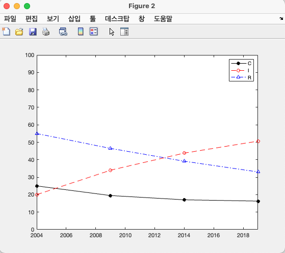
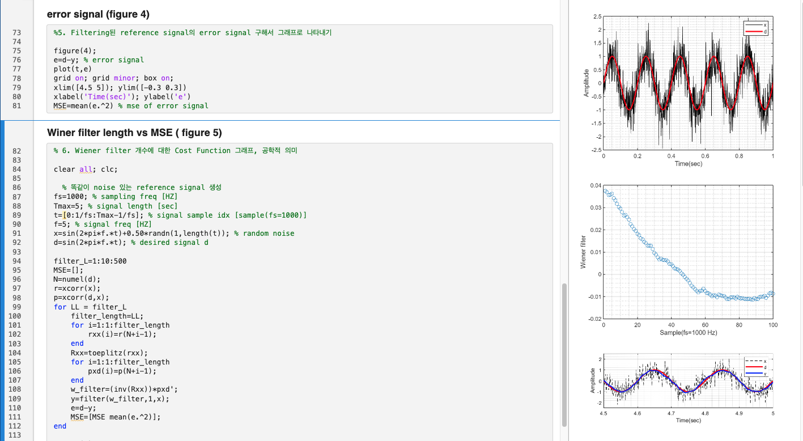
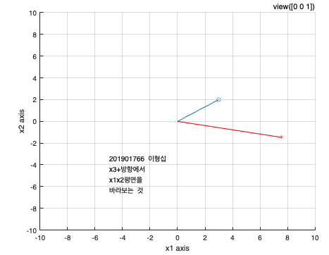
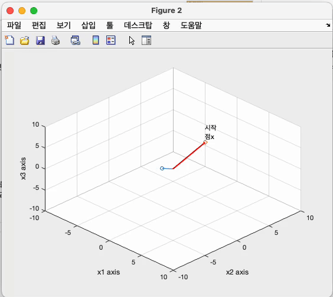
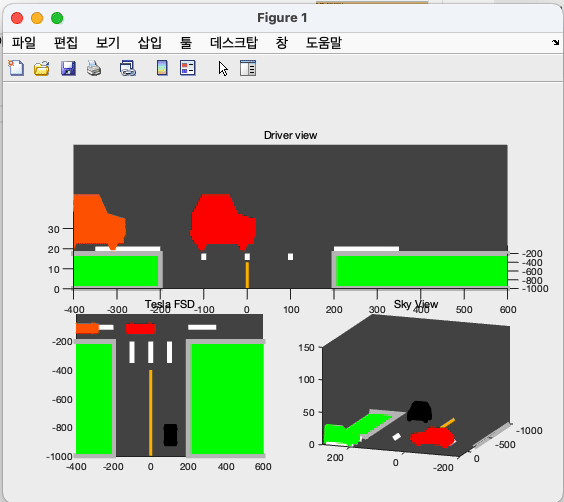

# INU_2-1_Linear_System


## `HW02 : Markov Process` 

``` 
2022_LinearSystems_Part1_1.pdf 의 p14 하단의 표를 matlab을 활용하여 그래프로 그릴 것.
```
* Result 

---

## `HW03 : Gaussian Elimination`

```
2022_LinearSystems_Part1_1.pdf p30 의 nauv_gauss 함수 코드에 대해 자세한 설명을 ppt 에 정리하여 제출 할 것.
```

---

## `HW04 : Gauss-Jordan Elimination`

```
1. 무수히 많은 해, 유일 해 & 해가 존재하지 않는 경우 3가지에 대한 가우스 소거법 Matlab 프로그램을 작성하고, 
   p31 - 33 의 예를 적용하였을 때의 출력을 과제 ppt 에 첨부할 것. 
2. p31의 무한히 많은 해가 존재하는 경우의 행렬을 Matlab rref 에 입력하였을 출력되는 결과를 캡처하여 과제 ppt에 첨부 할 것 (p39 참고). 
3. p36 & 44 예제를 손으로 풀이하고 사진찍어 과제 ppt 에 첨부 할 것. 
```

---

## `HW05 : Inverse Matrix`
```
1. p65 에 나오는 문제를 손으로 직접 풀고 사진 찍어서 과제 ppt 에 첨부할 것. 
2. p66 강의노트에 나오는 matlab 코드를 수행하고 코드 및 결과에 대해 최대한 자세히 설명할 것.
   ( p39 에서의 rref 사용시의 차이점, matrix B의 형태 및 matlab det 함수 등에 대한 설명이 포함되야 함.)
3. p69 p70 의 내용을 손으로 정리하고 사진 찍어서 과제 ppt 에 첨부할 것. 
```

---

## `HW06 : Norm`
```
p87 & p89 에 나오는 문제를 
1. 손으로 직접 플고 사진 찍어서 과제 ppt 에 첨부
2. Matlab 을 사용하여 계산하고 출력한 것을 캡쳐하여 과제 ppt 에 첨부
```

---

## `HW07 : Cross Product`

```
1. arccos 함수 그래프를 matlab 으로 그리고 캡처하여 과제 ppt 에 첨부할 것. 
2. 강의노트 p10 - 12 에 나오는 문제들을 손으로 풀고 사진 찍어서 과제 ppt 에 첨부할 것. 
   또한 matlab으로 같은 문제들을 계산해보고 손으로 풀었을 때와 결과를 비교 할 것.  
3. p12 의 두 vector a & b 와 cross product vector a x b 를 3D 좌표계에 나타낼 것. 
   손으로 깔끔하게 직접 그린 그림과 matlab 으로 그린 그림 두가지를 과제 ppt 에 첨부할 것. 
```

---

## `HW08 : Wiener filter`

```
1. 강의노트 Linear_Systems Part1_12에서 p21의 gradient of the cost function이 계산되는 과정을 손로 풀고 사진 찍어서 첨부 할 것. 
2. p22에 나오는 예제 2가지를 손으로 풀어서 사진 찍어 첨부 할 것. 
```

---

## `HW09 : Wiener filter`
```
1. p23 의 matlab 코드에서 수업시간에 교수님께서 말씀하신 6개의 질문에 대한 설명을 과제 ppt 에 정리 할 것. 
2. p26에 나오는 예제의 Matlab 코드를 실행하여 결과를 확인하고 과제 ppt 에 정리 할 것. 
```

* result(sample figure)


---

## `HW10 : Linear transformation`
```
강의노트 p11 에서 수업시간에 언급한 직사각형을 theta로 CCW 회전시킨 경우에 대한 기하학적인 풀이를 손으로 정리하고 과제 ppt 에 첨부하여 제출 할 것. 
```

---

## `HW11 : Matlab view function`
```
Matlab을 사용하여 p33 (그림 4개), p35 (그림 5개) & p36 (그림 4개) 에 나오는 그림들(총 13개)을 그리고 ppt 에 첨부할 것.
모든 그림에는 학번과 이름이 나와야 하며, ppt 에는 그림에 대한 설명과 사용된 view함수에 사용된 값을 명시 할 것. 
```

* result(sample figure)



---

## `HW12 : 3D Rotation`
```
강의노트 p30 의 ex3 번을 연속적으로 1도씩 회전하는 애니메이션이 되도록하는 Matlab 코드를 작성하고 애니메이션을 영상으로 캡쳐하여 ppt 에 첨부할 것. 
* x1축기준으로 1 도씩 60 도 회전한 후, x2축을 기준으로 1 도씩 45 도 회전하고, x3축을 기준으로 1도씩 30 도로 연속으로 회전하는 애니메이션이 되야함. 
* 애니메이션에서의 viewpoint 는 각자 자신이 원하는 값으로 하나로 고정할 것. 
```

* result(sample animation)



---

## `HW13 :  Linear transform2`
```
팔면체 다이아몬드가 회전을 하면서 자신의 이름 영어 대문자 이니셜(eg. YS)에 해당하는 궤적으로 이동하는 애니메이션을 만들 것. 
자신의 이름 영어 이니셜 두 문자가 동일한 경우 하나는 임의의 다른 이니셜을 사용 할 것. (e.g. SS (x) -> SH(o) )
팔면체 다이아몬드가 이니셜 궤적을 이동하는 동안의 상부 꼭짓점의 이동궤적을 남겨야 함.
단, 영어 대문자 이니셜 첫번째에서 두번째 이니셜로 이동하는 동안에는 궤적을 그리지 않아야 함. 
애니메이션에서의 view point는 계속 변화하도록 할 것. 
```
* result(sample animation)
  

---

## `HW14 : Linear transform3`
```
강의노트 p62 - 69 의 예제 7, 8 번을 수행하고 결과 영상을 캡쳐하여 ppt 에 첨부 할 것. 
ppt 에는 Matlab code에 대한 설명, 결과 영상을 모두 첨부해야 함. 
```

---


## `HW15 : Solar System Simulation`
```
1. 수업시간에 시청한 2019 example 영상들을 참고하여 태양계 시뮬레이션을 개선 할 것. 
2. ppt 에는 사용된 Matlab 코드에 대한 설명과 결과 에니메이션이 첨부되어 있어야 함.
```

* result(sample animation)


---

## `HW16 : Swaying Grass`
```
1. 교재에 나온 Matlab 코드를 직접 타이핑하고 코드를 실행 할 것.
2. 코드에 대한 해석을 ppt 에 정리 할 것. 
3. ppt 에는 사용된 Matlab 코드에 대한 설명과 결과 에니메이션이 첨부되어 있어야 함.
```

---

## `HW17 : Customized Swaying Grass`
```
1. 교재에 나온 Matlab 코드를 직접 타이핑하고 코드를 실행 할 것. (예시로 영상에서처럼 배경 그림을 추가 할 것. )
2. 코드에 대한 해석을 ppt 에 정리 할 것. 
3. 흔들리는 잔디 시뮬레이션을 개선 시킬 것. (잔디에 가지를 붙이기, 바람이 두 군데에서 불어 올 때 등 )
4. ppt 에는 사용된 Matlab 코드에 대한 설명과 결과 에니메이션이 첨부되어 있어야 함.
```

* result(sample animation)


---

## `Project : Tesla FSD Visualization`
```
Ego 차량이 도로에서 주행 중인 상황에 대해 3개의 화면을 애니메이션으로 만들 것. (강의노트의 Tesla FSD 주행 영상 참고)
* 3개 화면은 강의노트를 참고하여 차 안에서 전방을 보는 화면 1개, 허공에서 보는 화면 1개 (각도는 자유롭게 선정), Tesla FSD와 같은 화면 1개 로 구성 할 것. 
* 애니메이션에 등장하는 차종, 도로, 대수는 자유롭게 선정. ** 단, 최소 10대 이상의 차량이 애니메이션에 등장해야 함. 
* 애니메이션에는 ego 차량, 주변에서 주행하는 차량, 도로의 lane line 들만 나타낼 것. 
```

* result(sample animation)
